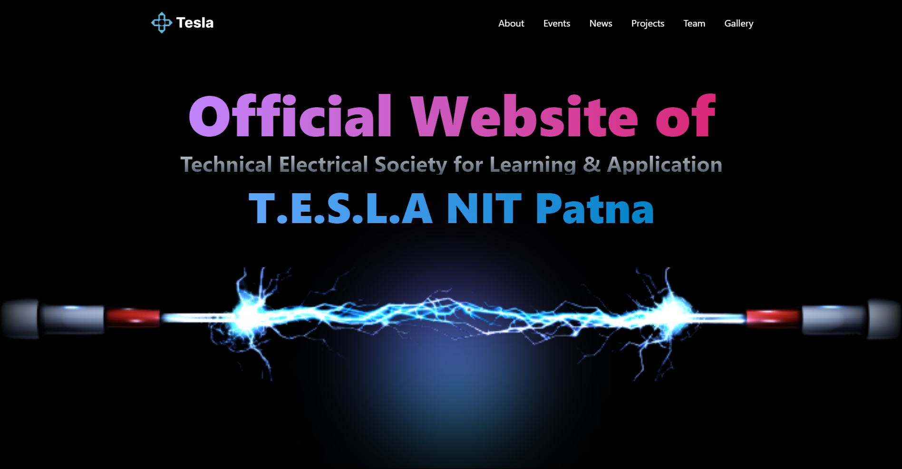

<h1 align='center'> Tesla Club NIT, Patna 🤖 </h1>
Tesla Club is the official club of electrical engineering department of NIT, Patna, the premier club for Electrical Engineering enthusiasts and professionals! Founded in 2021 by a group of bright-minded seniors, under the guidance of our esteemed PI - Dr. Amitesh Sir, T.E.S.L.A. Club is dedicated to fostering public speaking, teamwork, technical excellence, and management skills among its members. Our primary aim is to provide a platform for seniors, juniors, and alumni to come together, learn, grow, and secure rewarding careers in the field of Electrical Engineering.


# T.E.S.L.A. NITP Website
Official website of Tesla Club NIT Patna



Project has following functionalities

1. Creating a Component in React
2. Making HTTP calls
3. Communicating between parent and child component
4. Using Basic Routing in React
5. Using SCSS, CSS and Tailwind for Styling


# Prerequisites 👨‍💻

### Install Node JS
Refer to https://nodejs.org/en/ to install nodejs

### Install vite
Install Vite npm package globally. This will help to easily run the project and also build the source files easily. Use the following command to install vite

```bash
npm install -g vite
```

### Learn Tailwind CSS
This project uses `Tailwind CSS` if you don't have any hands-on experience with tailwind css then you can refer to their [docs](https://tailwindcss.com/).

### Learn React JS
If you are new to React JS then you can refer to their [docs](https://react.dev/).

### Learn SCSS
If you are new to SCSS then you can refer to their [docs](https://sass-lang.com/documentation).

### Learn Appwrite
If you are new to Appwrite then you can refer to their [docs](https://appwrite.io/docs).

## Live WebSite URL

The WebSite is deployed in https://tesla-nitp.vercel.app/

Click on the link to see the website.

## Cloning and Running the Application in local

Clone the project into local.

Install all the npm packages. 
Go into the root folder and type the following command to install all npm packages

```bash
npm install
```

Change the `.env.example` file to `.env` and add the required credentials.
(You can get the credentials from the admin of the project or you can create your own project in appwrite and use the credentials)

```bash
VITE_APPWRITE_PROJECT_ID=
VITE_APPWRITE_DATABASE_ID=
VITE_APPWRITE_BUCKET_ID=
```

In order to run the application Type the following command

```bash
npm run dev
```

The Application Runs on [http://localhost:5173/](http://localhost:5173/)


`Contributions are welcome 🎉🎉`

# Ways to contribute:
1. Solve the issues which are listed.
2. Create your own issue and then send PR.

Please refer to the project's style and contribution guidelines for submitting patches and additions. In general, we follow the "fork-and-pull" Git workflow.

 1. **Fork** the repo on GitHub
 2. **Clone** the project to your own machine
 3. **Commit** changes to your own branch
 4. **Push** your work back up to your fork
 5. Submit a **Pull request** so that we can review your changes


### 🚀 Please abide by  **Contributing Guidelines** and **Code of Conduct**.


## Contributors ✨

Thanks goes to these wonderful people ❤️:

<!-- ALL-CONTRIBUTORS-LIST:START - Do not remove or modify this section -->
<!-- prettier-ignore-start -->
<!-- markdownlint-disable -->
<a href = "https://github.com/SudhansuuRanjan/tesla-nitp-web/graphs/contributors">
  
</a>

<!-- markdownlint-restore -->
<!-- prettier-ignore-end -->

<!-- ALL-CONTRIBUTORS-LIST:END -->
